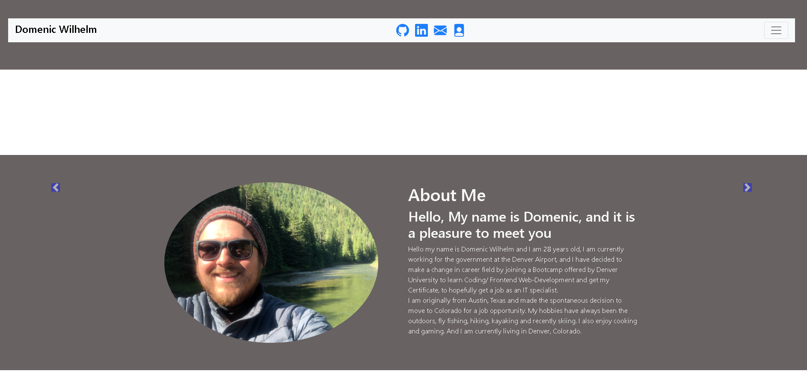

# Wilhelm-Web-Developer
This is an Updated  Portfolio of Domenic Wilhelm This document is my personal portfolio in which it has been be updated with new course works  and Class Projects. This portfolio will continue to be updated through out the course and later on in my career with new projects. 

Visit deployed site https://domenicsw92.github.io/Wilhelm-Web-Developer/

The header contains a collapsible nave bar with links to my GitHub, LinkedIn, Email, and Resume. When Nav bar is opened links will take user to content on site including information about me , current works, skills, and ways to contact me. The site is styled with third-part CSS BootStrap. Included works are in a container with slide actions that runs on a timer, the works are displayed on site with gif that shows the users a demonstration  on what developed works can do. When gif is click user will be transferred to a new tab of the deployed work. 

# Technologies-Libraries
    - Bootstrap - CSS Framework
